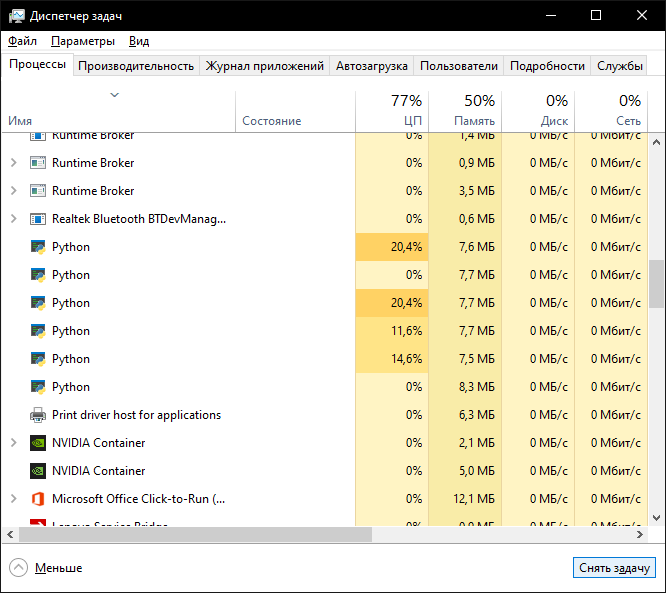

# Домашнє завдання #3

Реалізацію функції `factorize`, яка приймає список чисел та повертає список чисел, на які числа з вхідного списку поділяються без залишку.

## Процеси при виконанні програми

Програма реалізує факторизацію чисел методом `brute force` на прикладі значень `128, 255, 99999, 10651060, 70651060, 70651062`.

Реалізовано кілька способів:

- синхронний однопроцесорний код
- мультипоточний однопроцесорний код;
- мультипроцесорний код з пулом;
- мультипроцесорний код нз пулом executor;
- мультипроцесорний код з чергою.

На рисунку в диспетчері задач видно роботу процесів `Python` при факторизації:



## Приклад виведення результатів

```text
Однопроцесорний однопоточний код
--------------------------------------------------
Process number 128
Process number 255
Process number 99999
Process number 10651060
Process number 70651060
Process number 70651062
--------------------------------------------------
Час факторизації масиву чисел: 18.33
--------------------------------------------------


Однопроцесорний багатопоточний код
--------------------------------------------------
Process number 128
Process number 255
Process number 99999
Process number 10651060
Process number 70651060
Process number 70651062
--------------------------------------------------
Час факторизації масиву чисел: 18.03
--------------------------------------------------


Використання Pool
--------------------------------------------------
Process number 128 in process name SpawnPoolWorker-1
Process number 255 in process name SpawnPoolWorker-2
Process number 99999 in process name SpawnPoolWorker-3
Process number 10651060 in process name SpawnPoolWorker-1
Process number 70651062 in process name SpawnPoolWorker-4
Process number 70651060 in process name SpawnPoolWorker-2
--------------------------------------------------
Час факторизації масиву чисел: 10.07
--------------------------------------------------


Використання ProcessPoolExecutor
--------------------------------------------------
Process number: 128
Process number: 255
Process number: 99999
Process number: 10651060
Process number: 70651060
Process number: 70651062
--------------------------------------------------
Час факторизації масиву чисел: 9.87
--------------------------------------------------


Використання Quene
--------------------------------------------------
Process number 128 in process name Process-9
Process number 70651062 in process name Process-14
Process number 255 in process name Process-10
Process number 10651060 in process name Process-12
Process number 70651060 in process name Process-13
Process number 99999 in process name Process-11
--------------------------------------------------
Час факторизації масиву чисел: 10.34
--------------------------------------------------
```

З результаті видно, що багатопроцесорна реалізація дає виграш в швидкості приблизно вдвічі.
